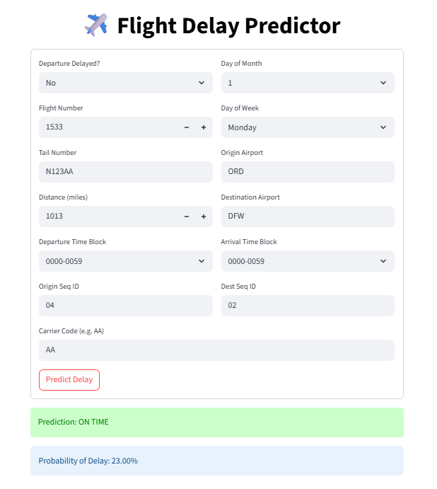
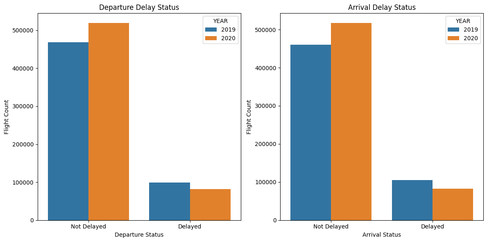
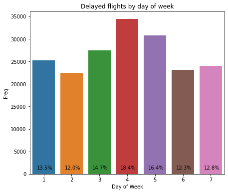
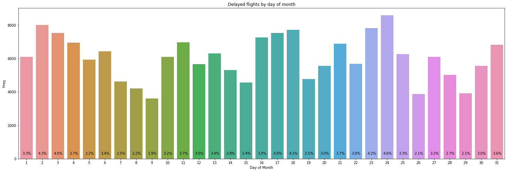
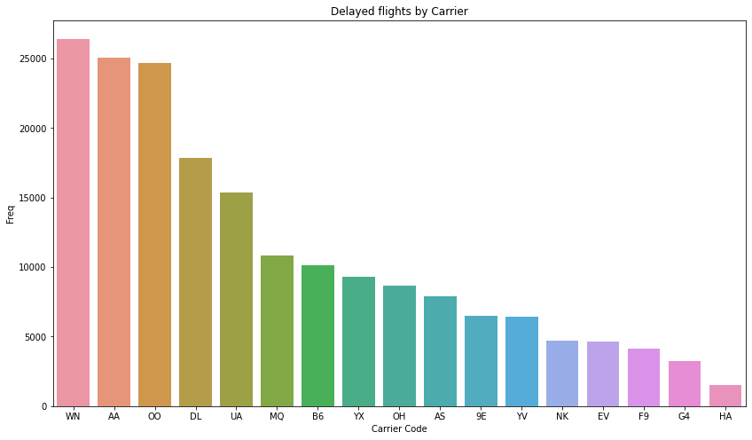
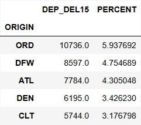
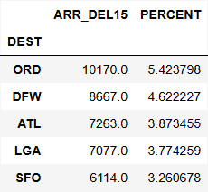
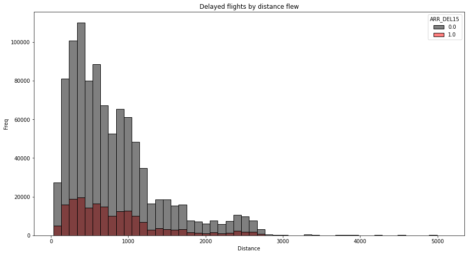
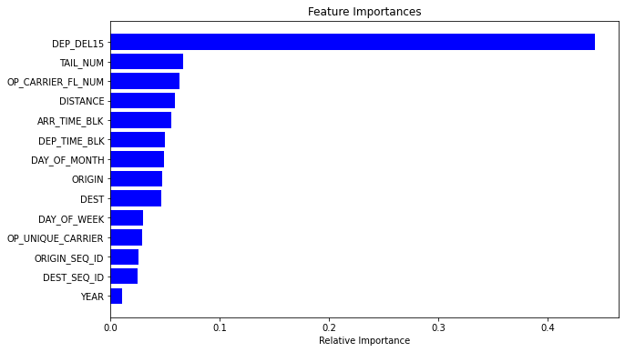

# Delayed Flights — From Research to Production

**A full-stack machine learning project** predicting flight arrival delays in the United States, evolving from an academic notebook to a containerized, orchestrated production pipeline with APIs, dashboards, and automation.

> *Completed:* Full project including modeling, orchestration, and containerized deployment  


## Project Purpose & Goals
Flight delays are a widespread issue affecting travelers and airlines. This project builds an interpretable and scalable ML model to **predict whether a flight will be delayed upon arrival**, using publicly available U.S. domestic flight data.

**Goals:**
- Understand key factors contributing to flight delays
- Build and evaluate interpretable classification models
- Develop a reproducible, automated ML pipeline
- Enable future extension with real-time dashboards and APIs


## Dataset Source & Description
**Source:** [Kaggle – Flight Delay Prediction Dataset](https://www.kaggle.com/datasets/divyansh22/flight-delay-prediction)  
**Coverage:** January 2019 and January 2020 U.S. domestic flights  
**Format:** 1.2M+ records, 20+ features including:
   - Date, origin/destination airports, carrier
   - Departure/arrival delay indicators (`DEP_DEL15`, `ARR_DEL15`)
   - Flight time, distance, time blocks

> Raw CSV files are located in: `data/raw/`


## Tools & Technologies
| Phase | Tools & Libraries |
|-------|--------------------|
| **EDA & Modeling** | pandas, numpy, matplotlib, seaborn, scikit-learn, xgboost, imbalanced-learn |
| **Pipeline & Packaging** | Flask, Streamlit, Airflow, Docker, Git |
| **Automation & Deployment** | Docker Compose, Python scripts, Airflow DAGs |


## ML Modeling Workflow
### Preprocessing Steps
- Dropped missing values (minority portion)
- Created custom time-block features (e.g., `DEP_TIME_BLK`)
- Label-encoded categorical features
- Balanced the dataset using `RandomOverSampler`

### Models Evaluated
- Logistic Regression
- Stochastic Gradient Descent (SGD)
- Decision Trees
- Random Forest
- Support Vector Machine(SVC)
- Gradient Boosting
- XGBoost

### Evaluation
- Metrics: Accuracy, Precision, Recall, F1 Score
- Cross-validation with `GridSearchCV`
- Final Model: **Random Forest** (best performance)
- Saved serialized model and label encoder to `.pkl` files


## Project Structure
```bash
DelayedFlights/
├── airflow/                        ← Apache Airflow DAGs & Docker setup
│   ├── dags/                       ← Scheduled ML workflow definitions
│   ├── docker-compose.airflow.yml  ← Orchestration for Airflow services
│   ├── Dockerfile.airflow          ← Custom Airflow image setup
│   └── requirements.airflow.txt    ← Airflow-specific Python packages
│
├── app/                            ← Core machine learning logic (train, predict, preprocess)
│   ├── api                         ← Flask API for predictions
│   ├── model/                      ← Training, inference, serialization
│   └── preprocessing/              ← Data cleaning and transformation
│
├── dashboard/                      ← Streamlit UI app
│
├── data/
│   ├── model/                      ← Saved .pkl model artifacts
│   └── raw/                        ← Raw CSV flight data
│
├── notebooks/                      ← Exploratory notebooks and modeling experiments (.ipynb/.py)
├── reports/                        ← Academic report and presentation (PDF)
│
├── docker-compose.yml              ← Dev container orchestration (Streamlit/API)
├── Dockerfile                      ← Dockerfile for base app
├── requirements.txt                ← Main project dependencies
├── StreamlitDockerfile             ← Dockerfile for Streamlit app
└── README.md                       ← You’re here!
```


## End-to-End Pipeline Flow
### 1. EDA & Modeling (Academic Phase)
- **Jupyter notebook:** `notebooks/notebook_delayed_flights.ipynb`
- **Converted script:** `notebooks/script_delayed_flights.py`

### 2. Preprocessing Script
- **Input:** Raw CSVs
- **Output:** Cleaned feature matrix and label vector
- **File:** `app/preprocessing/data_pipeline.py`

### 3. Model Training
- **Loads:** Processed data
- **Trains:** Classifier and saves `.pkl` artifacts
- **File:** `app/model/train_model.py`

### 4. Prediction
- **Loads:** Trained model and label encoder
- **Input:** New flight data (as a dictionary) from user
- **Output:** Delay prediction and label
- **File:** `app/model/predict_model.py`

### 5. Workflow Automation (Airflow)
- **DAG Orchestration:** Runs preprocessing → training
- **File:** `airflow/dags/flight_delay_pipeline.py`


## How to Run the Project
This project supports running different components independently or as part of an end-to-end ML pipeline. Follow the appropriate section below based on your use case.

### 1. EDA & Local Modeling (Jupyter Notebook)
> Useful for exploratory data analysis, data cleaning, and initial model building.  

*Prerequisites:* Install dependencies from `requirements.txt`  

**Steps:**
- Clone the repo:
```bash
git clone https://github.com/janithpe/DelayedFlights.git
cd DelayedFlights
```

- Launch Jupyter Notebook:
```bash
jupyter notebook notebooks/notebook_delayed_flights.ipynb
```

- Explore and experiment with:
   - Flight data loading
   - Visualizations and feature engineering
   - Classifier comparison and model selection

### 2. Streamlit Dashboard (via Docker)
> Run a live interactive dashboard for delay prediction without setting up Python locally.  

*Prerequisites:* Install [Docker Desktop](https://www.docker.com/products/docker-desktop/)

**Steps:**
- Clone the repo:
```bash
git clone https://github.com/janithpe/DelayedFlights.git
cd DelayedFlights
```

- Build and launch containers:
```bash
docker compose -f docker-compose.yml up --build
```

- Then visit the dashboard:
```bash
http://localhost:8501
```
> Example view  


### 3. Full Pipeline with Apache Airflow (via Docker)
> Automate the ML pipeline: preprocessing → training → model saving using scheduled DAGs.  

*Prerequisites:* Install [Docker Desktop](https://www.docker.com/products/docker-desktop/)

**Steps:**
- Clone the repo:
```bash
git clone https://github.com/janithpe/DelayedFlights.git
cd DelayedFlights/airflow
```

- Build and launch containers:
```bash
docker compose -f docker-compose.airflow.yml up --build
```

- Access the Airflow UI:
```bash
http://localhost:8080
```
Username: `airflow`, Password: `airflow`

- Trigger the DAG:
   - The `flight_delay_pipeline` DAG will:
      - Load and clean flight data
      - Train a classifier
      - Save .pkl model artifacts to /data/model/


> *Note:*
> - All data files are expected under data/raw/
> - Trained models are saved in data/model/
> - Airflow mounts the app/ directory for code access inside Docker
> - *Tip:* Stop existing Docker containers with `docker compose down`  


## Summary of Model Evaluation
Model development and evaluation were initially conducted as part of academic research using January flight data from 2019 and 2020. The final model was assessed using both a hold-out test set and 5-fold cross-validation to ensure robustness.

Key evaluation metrics included Accuracy, Precision, Recall, and F1 Score.
| Model | Accuracy | Precision | Recall | F1 Score |
|-------|----------|-----------|--------|----------|
| Logistic Regression | 0.85 | 0.95 | 0.74 | 0.83 |
| Decision Tree | 0.95 | 0.91 | 0.99 | 0.95 |
| *Random Forest* | *0.98* | *0.96* | *0.99* | *0.98* |
| XGBoost | 0.90 | 0.93 | 0.86 | 0.90 |

**Feature importance** (via Random Forest) showed departure delays, carrier, and flight distance as top contributors.

### Final Model Selection:
The Random Forest classifier demonstrated the best balance of performance and interpretability, and was chosen as the production model for the end-to-end ML pipeline.  
*For a complete breakdown of model comparisons and evaluation metrics, refer to the accompanying academic report.*


## Visual Insights
Key charts from the EDA notebook:
1. Flight delay trends by year: Departures vs Arrivals

2. Delayed arrivals by day-of-week  

3. Delayed arrivals by day-of-month  
  
4. Delayed arrivals by carrier  

5. Top 5 Airports with frequent delays
<table>
  <tr>
    <td>
      <br/>
      <span style="font-size:12px">Departure Delays</span>
    </td>
    <td>
      <br/>
      <span style="font-size:12px">Arrival Delays</span>
    </td>
  </tr>
</table>  

6. Delayed flight frequency by distance flew  

7. Feature importance under Random Forest Classification
  

> Full analysis available in notebook and project report  


## Academic Deliverables
- [Report: Analysis of Delayed Flights](reports/report_delayed_flights.pdf)
- [Presentation Slides](reports/presentation_delayed_flights.pdf)

These documents were submitted for academic credit in my Master’s program, summarizing methods, insights, and conclusions.


## Lessons Learned  
- **Data quality matters** — Real-world datasets are often messy, imbalanced, or incomplete. Robust preprocessing pipelines are essential for meaningful insights.  
- **Efficiency through sampling** — Training on all 1.2M records wasn't scalable. Using a representative sample with class balancing dramatically reduced training time without sacrificing accuracy.  
- **Orchestration adds value** — Integrating Apache Airflow added automation, reproducibility, and operational readiness to the ML pipeline — crucial for real-world deployment.  


## Future Enhancements  
- **Integrate external factors like weather and airport congestion**  
Enhance prediction accuracy by incorporating weather conditions, traffic data, and other real-time operational variables.  
- **Year-round prediction capability**  
Extend the dataset beyond January to support seasonal analysis and generalize predictions across the full calendar year.  
- **Model monitoring & drift detection**  
Integrate tools like Evidently or Prometheus for monitoring model performance in production and detecting concept drift.  
- **Explore deployment to cloud**  
Package and host the entire system (API, dashboard, pipeline) on cloud platforms such as AWS, GCP, or Azure for broader accessibility.  


## License
This project is intended for **educational and portfolio demonstration purposes only.**  
The dataset used is publicly available on [Kaggle](https://www.kaggle.com), originally sourced from the **U.S. Bureau of Transportation Statistics.**

No commercial use or redistribution is intended.  
<br>
<br>

---

**Authored by:** *Janith Perera*  
M.S. in Data Science | [LinkedIn](https://www.linkedin.com/in/janith-perera-3941821a2/)